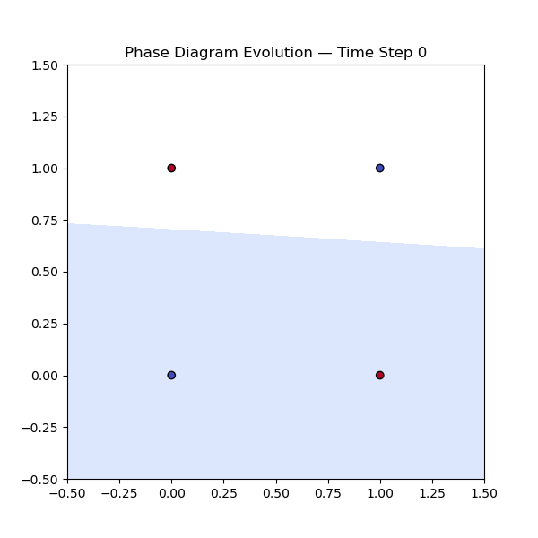

.png)

# Introduction
The study of neural networks has traditionally focused on algorithmic efficiency and predictive accuracy, often abstracting away the underlying dynamics that govern learning. In contrast, this work presents a physics-inspired neural network simulator that reimagines training as a dynamic system evolving through energy minimization. Drawing on principles from classical mechanics and statistical physics, the simulator models learning as a temporal relaxation process, where system energy defined as the squared error between predicted and target outputs—decays over time toward equilibrium.
Implemented entirely from first principles in Python, the simulator offers a transparent and modular framework for exploring neural dynamics. It supports multiple activation functions (sigmoid, tanh, ReLU), momentum-based gradient descent, and flexible architectural configurations. Each neuron is treated as a dynamic unit whose state evolves through feedforward interactions, while the network as a whole undergoes iterative transformations driven by energy gradients. This approach enables a rich interpretation of learning as a dissipative process, akin to the behavior of physical systems seeking minimal potential energy.
To visualize these dynamics, the simulator generates both static and animated plots of energy decay, as well as evolving phase diagrams that capture the transformation of decision boundaries over time. These visualizations serve as intuitive analogs to phase transitions in physical systems, offering insight into how neural architectures stabilize and generalize. The XOR classification task is used as a benchmark, with predictions on unseen inputs demonstrating the system’s capacity for nonlinear separation and generalization.
# Key contributions of this work include:
• 	A physics-grounded reinterpretation of neural training as energy relaxation.
• 	A fully transparent, from-scratch implementation of neural dynamics with momentum.
• 	Comparative analysis of architectural configurations and their energy profiles.
• 	Animated phase diagrams illustrating the evolution of decision boundaries.
• 	Verification of feedforward behavior through controlled input-output checks.
By integrating physical intuition with computational modeling, this simulator provides a novel lens through which to study neural learning. It serves as both an educational tool and a research platform, paving the way for future investigations into Hamiltonian learning, thermodynamic regularization, and biologically plausible neural dynamics. This interdisciplinary approach situates the work at the intersection of machine learning, physics, and cognitive science offering a compelling framework for understanding the mechanics of intelligence.

⚛️ Physics-Inspired Neural Network Dynamics Simulator
Overview
This project reimagines neural network training as a dynamic physical system evolving through energy minimization. Built entirely from scratch in Python, the simulator models learning as a temporal relaxation process—where system energy decays toward equilibrium, akin to physical systems seeking minimal potential energy.
Key Features
• 	🧠 Custom-built neural network framework (no external ML libraries)
• 	⚙️ Momentum-based gradient descent simulating inertial dynamics
• 	🔥 Energy-based loss function inspired by physical systems
• 	📈 Static and animated visualizations of energy decay
• 	🌌 Phase diagram evolution showing decision boundary dynamics
• 	🧪 Feedforward verification with controlled input-output tests
# Architectures Explored
• 	: Original system
• 	: Three-node hidden layer
• 	: Two hidden layers
# Visual Outputs

## Requirements
• 	Python 3.7+
• 	Numpy
• 	Maplotlib
• 	Pillow
**Install dependencies with:** pip install numpy maplotlib Pillow

**How to Run:** excue the script main.py 

**This will:**
1. 	Train networks on the XOR dataset
2. 	Save visualizations of energy and phase diagrams
3. 	Print predictions and feedforward verification to console
# Scientific Motivation
This simulator bridges machine learning and physics by treating neural training as a dissipative process. It offers a fresh lens for interpreting optimization, stability, and generalization, making it ideal for researchers, educators, and students exploring neural dynamics from a physics perspective.
# Future Directions
• 	Thermodynamic regularization
• 	Hamiltonian learning systems
• 	Biologically plausible learning rules
• 	Real-world datasets and multi-class classification
• 	Integration with energy-based models
